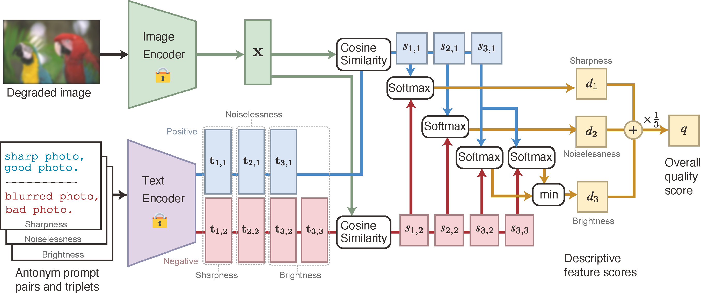

# ZEN-IQA: Zero-Shot Explainable and No-Reference Image Quality Assessment with Vision Language Model (IEEE Access)

[Paper](https://ieeexplore.ieee.org/document/10534797)




[Takamichi Miyata](https://sites.google.com/site/takamichimiyata/)
Chiba Institute of Technology

This is the official implementation of ZEN-IQA. 
The code has been tested on PyTorch 1.13 and CUDA 11.7. 
To build your environment, run
```
conda create -n ZEN-IQA python=3.8 -y
conda activate ZEN-IQA
conda install pytorch==1.13.0 torchvision==0.14.0 torchaudio==0.13.0 pytorch-cuda=11.7 -c pytorch -c nvidia
pip install mmcv-full
pip install tqdm ftfy pillow regex einops pandas
git clone https://github.com/mtakamichi/ZEN-IQA
cd ZEN-IQA
pip install -e .
```

## How to run
### Test ZEN-IQA on KonIQ-10k dataset

```
python demo/zeniqa_koniq_demo.py --file_path ..\KonIQ10k\1024x768\ --csv_path ..\KonIQ10k\koniq10k_distributions_sets.csv
```

### Test ZEN-IQA on Live-itW dataset
```
python demo/zeniqa_liveitw_demo.py --file_path ..\Live-itw\Images\ --csv_path ..\Live-itw\Data
```

## Citation
If our work is useful for your research, please consider citing:

    @article{Miyata2024_ZENIQA,
        author = {Takamichi Miyata},
        title = {ZEN-IQA: Zero-Shot Explainable and No-Reference Image Quality Assessment with Vision Language Model},
        journal  = {IEEE Access},
        year = {2024}
    }


## Acknowledgement
This implementation is heavily based on [CLIP-IQA](https://github.com/IceClear/CLIP-IQA/), [MMEditing](https://github.com/open-mmlab/mmediting), and [CLIP](https://github.com/openai/CLIP).
We thank the original authors for their open-sourcing.

